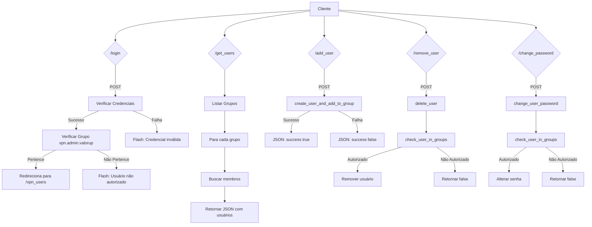

# VPN Users

Este é um sistema de gerenciamento de usuários VPN desenvolvido em Python usando Flask. O sistema permite que administradores autorizados (membros do grupo vpn.admin.valorup) realizem as seguintes operações:

- Login com autenticação de credenciais
- Listagem de usuários por grupos
- Adição de novos usuários
- Remoção de usuários existentes 
- Alteração de senhas
- Alteração de grupos
- Bloqueio/desbloqueio de usuários

O sistema implementa verificações de segurança, garantindo que apenas usuários autorizados possam realizar operações administrativas. Todas as operações são registradas em log para auditoria.

A interface web utiliza Bootstrap para o layout e SweetAlert2 para notificações interativas. As operações são realizadas via requisições AJAX para uma API REST implementada com Flask.

O backend interage com o sistema operacional Linux para gerenciar os usuários e grupos através de comandos como useradd, userdel, usermod e chpasswd.


## Flowchart




## Instalação e Inicialização

### Pré-requisitos

- Python 3.8 ou superior
- Sistema operacional Linux
- Privilégios de root/sudo para gerenciamento de usuários

### Instalação

1. Clone o repositório:
    ```bash 
    git clone https://github.com/valorup/vpn_users.git
    ```
2. Instale as dependências:
    ```bash
    cd vpn_users
    pip install -r requirements.txt
    ```
3. Edite o arquivo groups.txt com os grupos que deseja gerenciar:
    ```bash
    cp groups.txt.example groups.txt
    vim groups.txt
    ```
4. Inicie o servidor:
    ```bash
    sudo python main.py
    ```

### Configuração

- Ajuste as credenciais de acesso no arquivo .env conforme necessário.
- Configure o arquivo de configuração do OpenVPN conforme necessário.
