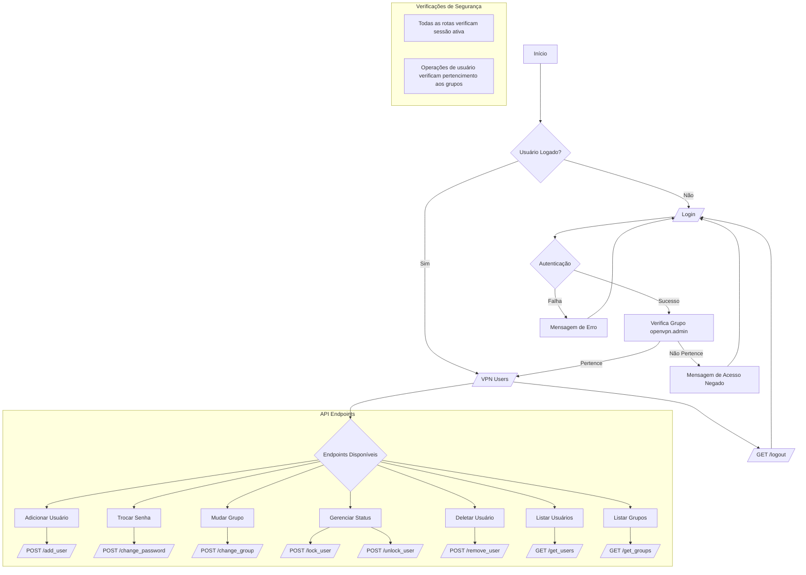

# VPN Users

Este é um sistema de gerenciamento de usuários VPN desenvolvido em Python usando Flask. O sistema permite que administradores autorizados (membros do grupo openvpn.admin) realizem as seguintes operações:

- Login com autenticação de credenciais
- Listagem de usuários por grupos
- Adição de novos usuários
- Remoção de usuários existentes 
- Alteração de senhas
- Alteração de grupos
- Bloqueio/desbloqueio de usuários

O sistema implementa verificações de segurança, garantindo que apenas usuários autorizados possam realizar operações administrativas. Todas as operações são registradas em log para auditoria.

A interface web utiliza Bootstrap para o layout e SweetAlert2 para notificações interativas. As operações são realizadas via requisições AJAX para uma API REST implementada com Flask.

O backend interage com o sistema operacional Linux para gerenciar os usuários e grupos através de comandos como useradd, userdel, usermod e chpasswd.


## Flowchart




## Instalação e Inicialização

### Pré-requisitos

- Python 3.8 ou superior
- Sistema operacional Linux
- Privilégios de root/sudo para gerenciamento de usuários

### Passos de Instalação
## Deployer (script de instalação automatizada)

O repositório inclui um script de deployer (`openvpnmanager_deployer.sh`) que automatiza a preparação do servidor, instalação da aplicação, criação do virtualenv, instalação das dependências, configuração do serviço systemd e regras de firewall.

Principais ações que o script realiza:

- Clona/atualiza o repositório em `APP_DIR` (por padrão `/OpenVPN-User-Manager`).
- Cria e prepara um virtualenv em `${APP_DIR}/venv` e instala `requirements.txt` (se presente).
- Cria e habilita um serviço systemd (`openvpn-user-manager`) que executa o `main.py` com o venv.
- Adiciona regra de firewall (iptables) para a porta configurada (por padrão 3223) e persiste via `/etc/rc.local`.
- Garante existência do grupo de administradores (`openvpn.admin`) e oferece um menu para ajustar grupos do arquivo `groups.txt`.

Observações importantes

- Execute o script como root (ou via sudo). Ele precisa de privilégios para criar usuários/grupos, editar systemd e regras de firewall.
- Por padrão o script usa `APP_DIR="/OpenVPN-User-Manager"`. Altere o script se precisar instalar em outro diretório.
- O script cria o serviço systemd executando o Python do virtualenv, portanto o serviço roda como `root` para permitir gerenciamento de usuários do sistema.

Como usar

- Executar interativamente (menu será exibido no final):

```bash
sudo ./openvpnmanager_deployer.sh
```

- Executar em modo não interativo (pula o menu de grupos):

```bash
sudo ./openvpnmanager_deployer.sh --non-interactive
# ou
sudo ./openvpnmanager_deployer.sh -n
```

Menu interativo

Ao final do deploy, se executado sem `--non-interactive`, o script apresenta um menu com as opções:

1) Adicionar um usuário ao grupo `openvpn.admin`
   - Permite inserir um nome de usuário existente para adicioná-lo ao grupo de administradores.
   - Se o usuário não existir, o menu oferece criar o usuário e definir a senha padrão `Mudar@123` antes de adicioná‑lo ao grupo.

2) Limpar o arquivo `groups.txt` e usar apenas o grupo `user.vpn`
   - Substitui o conteúdo de `groups.txt` por `user.vpn` e cria o grupo `user.vpn` no sistema caso não exista.

3) Limpar o arquivo `groups.txt` e adicionar grupos ao sistema
   - Permite digitar uma lista de grupos (separados por espaço). O script criará cada grupo no sistema e gravará os nomes em `groups.txt`.

4) Sair
   - Sai do menu e reinicia o serviço `openvpn-user-manager`.

Logs e troubleshooting

- O script imprime mensagens coloridas no terminal (INFO/OK/WARN/ERROR) durante a execução.
- Se houver falha na instalação de pacotes ou na criação do venv, verifique a saída do terminal e corrija permissões ou dependências do sistema.
- Depois do deploy, o serviço systemd é iniciado e pode ser verificado com:

```bash
sudo systemctl status openvpn-user-manager
sudo journalctl -u openvpn-user-manager -f
```

Exemplo de fluxo rápido

1. Copie `groups.txt.example` para `groups.txt` e edite conforme necessário.
2. Rode o deployer em modo não interativo (para instalar e configurar rapidamente):

```bash
sudo ./openvpnmanager_deployer.sh --non-interactive
```

3. Se quiser ajustar grupos ou criar o primeiro administrador pelo menu, execute sem `--non-interactive`.